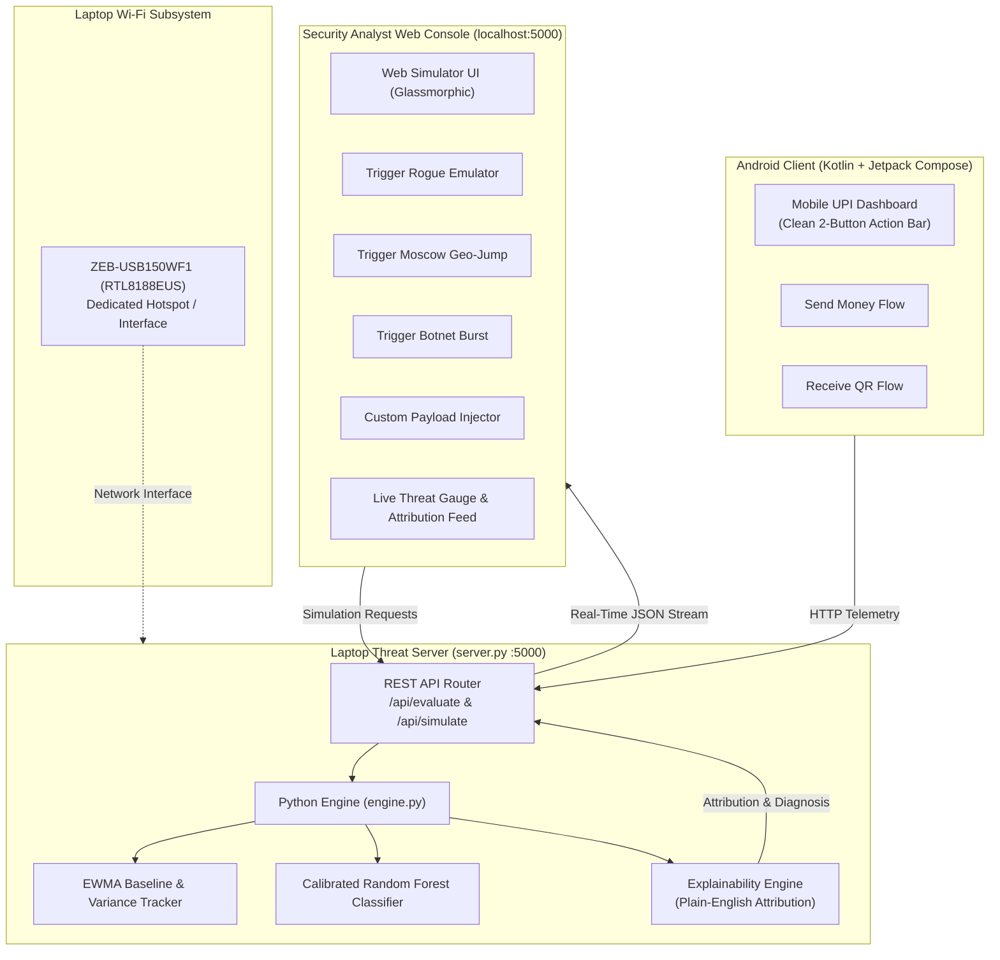

# SentinelUPI System Architecture & Developer Guide

SentinelUPI is a production-grade, adaptive UPI fraud detection and explainable attribution platform. It features both a full Python engine/dashboard (`engine.py`, `app.py`) and a native Android application (`app/`) built with Kotlin and Jetpack Compose (Material 3) supporting Android 8.0+ (API 26) through Android 14 (API 34).

---

## 1. High-Level Architecture Overview

```
                      +---------------------------------------+
                      |         SentinelUPI Mobile App        |
                      |        (Jetpack Compose UI)           |
                      +-------------------+-------------------+
                                          |
               +--------------------------+--------------------------+
               |                                                     |
               v                                                     v
+-----------------------------+                       +-----------------------------+
|    SentinelEngine (Kotlin)   |                       |    LanP2PManager (Sockets)  |
|  - UserProfile (EWMA State) |                       |  - Port 8989 Server         |
|  - FeatureExtractor         |                       |  - Subnet Peer Discovery    |
|  - FraudClassifier (Rules)  |                       |  - Direct JSON Pay Protocol |
|  - ExplainabilityEngine     |                       +-----------------------------+
+-----------------------------+                                      |
               ^                                                     v
               | (Trained Weights & Parity)           +-----------------------------+
+-----------------------------+                       |  Peer Android Device (LAN)  |
|      Python Core Engine     |                       |  - Port 8989 P2P Receiver   |
|  - Random Forest Classifier |                       +-----------------------------+
|  - Streamlit Dashboard      |
|  - Continuous Stream Tester |
+-----------------------------+
```

---

## 2. Directory & Component Layout

```text
upi-fraud-detector/
├── architecture.md                     # This document: primary reference for all agents
├── README.md                           # Quickstart and overview
├── prompt.txt                          # Project specifications & prompts
├── requirements.txt                    # Python dependencies
├── logo.jpg                            # Master brand logo (converted to all Android mipmaps)
│
├── app/                                # Native Android Application
│   ├── build.gradle                    # AGP 8.4.0, Kotlin 1.9.23, Compose BOM 2024.04.00, minSdk 26
│   ├── proguard-rules.pro
│   └── src/main/
│       ├── AndroidManifest.xml         # Network, Wi-Fi & activity permissions
│       ├── res/                        # App logo, mipmaps, colors, themes, strings
│       └── java/com/sentinelupi/frauddetector/
│           ├── MainActivity.kt         # App container, scaffold, tab navigation
│           ├── model/                  # Data classes: Transaction records, Peer info, Payment payload
│           ├── engine/                 # Native Kotlin Fraud Detection & Explainability Engine
│           │   └── SentinelEngine.kt   # EWMA profiles, Haversine, FeatureExtractor, Classifier, Explainability
│           ├── network/                # Local network peer-to-peer subsystem
│           │   └── LanP2PManager.kt    # ServerSocket(8989), discovery probes, sendPayment()
│           ├── ui/
│           │   ├── theme/              # Color.kt, Theme.kt (Fintech Dark Palette)
│           │   ├── components/         # Reusable widgets: BalanceCard, AttackWarningDialog, etc.
│           │   └── screens/            # UpiHomeScreen, PassbookScreen, ThreatLabScreen, ProfileScreen
│
├── engine.py                           # Python reference engine (EWMA, FeatureExtractor, Random Forest)
├── app.py                              # Streamlit interactive web dashboard
├── generate_sentinelupi.py             # Synthetic UPI dataset generator with tricky edge cases
├── test.py                             # Diagnostic CLI (Condition inspector, 6 core scenarios)
├── tester.py                           # Real-time consecutive scenario streamer (bridges to port 8501)
├── tests/                              # Python unit test suite
│   ├── __init__.py
│   └── test_sentinel.py
└── data/                               # Generated datasets, trained models, stream state
    ├── transactions.csv                # 3,600 realistic UPI transaction records
    ├── fraud_model.joblib              # Serialized Random Forest model
    ├── live_stream.json                # Live stream communication state
    └── wrong_guesses.json              # Error inspection log for port 8501
```

---

## 3. Fraud Detection Engine Mechanics

The detection engine uses a **Behavioral Baseline + Multi-Vector Anomaly Scoring** paradigm rather than blunt global thresholds.

### A. EWMA Dynamic User Baseline
Each user profile (`UserProfile`) maintains:
- $\mu_{\text{EWMA}}$: Exponentially Weighted Moving Average of spend amount.
- $\sigma_{\text{EWMA}}$: Standard deviation of spend amount.
- $\alpha = 0.10$: Daily drift learning rate.
- $\alpha = 0.35$: Accelerated adaptation rate when a human-in-the-loop confirms a legitimate anomaly (e.g., festival shopping or new phone purchase).
- Trusted Hardware Registry: Map of verified device IDs to hardware models.
- Trusted Geographies: List of verified home and frequent cities.

### B. High-Precision Feature Vectors
1. `z_score_amount`: $(Amount - \mu) / \sigma$
2. `spend_multiplier`: $Amount / \max(\mu, 1.0)$
3. `is_known_device`: 1 if device ID is in trusted hardware registry, else 0.
4. `is_known_city`: 1 if location is in trusted cities, else 0.
5. `is_nocturnal`: 1 if transaction occurs between 01:00 AM and 05:30 AM IST.
6. `velocity_kmh`: Haversine distance between current and last transaction location divided by elapsed hours.
7. `txn_velocity_1h`: Transaction count in a rolling 60-minute window.
8. `hostile_triad_score`: $(1 - \text{is\_known\_device}) \times [1.5(\text{nocturnal}) + 2.0(\text{velocity} > 800) + 1.0(1 - \text{is\_known\_city})]$
9. `device_risk_penalty`: $(1 - \text{is\_known\_device}) \times [1.5(1 - \text{is\_known\_city}) + 1.2(\text{nocturnal})] \times \ln(1 + \text{spend\_mult})$
10. `geo_velocity_anomaly`: Binary flag if velocity exceeds 850 km/h.
11. `p2p_novel_device_risk`: Critical interaction flag: $1 \text{ if } (\text{is\_known\_device} = 0 \text{ and category } \in \{\text{P2P\_Transfer}, \text{Gaming\_Crypto}\}) \text{ else } 0$.

### C. Decision & Action Tiers
- **Risk Score 0–24.9 (LOW)**: `ALLOW` -> Proceed directly to UPI PIN entry.
- **Risk Score 25–54.9 (MEDIUM)**:
  - If new device in home city during daytime for retail spend: `BENIGN_DEVICE_UPGRADE` -> `ALLOW_WITH_NOTIFY_AND_LEARN`.
  - If high spend on trusted phone: `BENIGN_LIFESTYLE_ANOMALY` -> `ALLOW_WITH_NOTIFY_AND_LEARN`.
- **Risk Score 55–74.9 (HIGH)**: `HIGH_ANOMALY_SUSPICIOUS` -> `STEP_UP_OTP_VERIFICATION`.
- **Risk Score 75–100 (CRITICAL)**: `HOSTILE_ACCOUNT_TAKEOVER` -> `CHALLENGE_BIOMETRIC_OR_BLOCK`.

---

## 4. Local LAN P2P Payment Subsystem

The Android app features real local network peer-to-peer communication without requiring an external payment switch:

1. **Protocol**: Lightweight JSON over raw TCP sockets.
2. **Port**: `8989` (default).
3. **Actions**:
   - `DISCOVER`: Probe device to query name, UPI ID, and status.
   - `PAYMENT`: Payload includes `transactionId`, `senderUpi`, `senderDevice`, `senderCity`, `amount`, and `note`.
4. **Execution Flow**:
   - Device A initiates payment -> SentinelEngine evaluates risk locally.
   - If allowed: funds deduct from Device A balance -> TCP packet dispatched to Device B IP on port 8989.
   - Device B accepts packet -> adds funds to Device B balance -> creates passbook record -> returns `SUCCESS` response.
   - If suspicious (e.g. "Simulate Attack"): payment is intercepted and blocked before transmission, showing exact reasons why.

---

## 5. Build & Compilation Standards

All Android development must strictly adhere to:
- **Gradle Command**: `./gradlew assembleDebug`
- **Output Artifact**: `app/build/outputs/apk/debug/app-debug.apk`
- **Supported Android Versions**: Min SDK 26 (Android 8.0 Oreo) up to Target SDK 34 (Android 14).
- **Tooling Compatibility**: AGP 8.4.0, Kotlin 1.9.23, OpenJDK 17.

When any agent modifies files, they must verify `./gradlew assembleDebug` passes with 0 compilation errors and update this document with any architectural shifts.

---

## 6. Translucent Glossy Design System & UI Architecture

The visual theme uses a **translucent glass surface with glossy highlights**. It should feel polished and lightweight while preserving clear contrast and legibility for payment amounts, security states, and actions.
- **Palette and surfaces**:
  - Soft light canvas: Alabaster (`#F8FAFC`) with subtle cool gradients.
  - Translucent cards: white at roughly 72% opacity, with a fine bright edge (`rgba(255, 255, 255, 0.95)`) and restrained backdrop blur.
  - Glossy accents: cool sky blue (`#0284C7`) for connectivity and mint (`#10B981`) for verified security; use soft, diffuse glows sparingly.
  - Text: Deep Slate (`#0F172A`) for primary content, Slate (`#64748B`) for secondary content, and muted Slate (`#94A3B8`) for captions.
- **Glossy elements**:
  - Use a subtle top-edge sheen, layered translucent fills, rounded corners, and soft shadows to give cards and controls a glass-like finish.
  - Keep buttons glossy through a restrained highlight and clear pressed state; maintain readable labels and obvious touch targets.
  - Reserve stronger glow and color for key actions, successful verification, warnings, and risk states. Avoid effects that obscure transaction details.
- **Typography**:
  - Use the existing Material 3 typography definitions configured in `Type.kt` and applied through `SentinelTheme`; prioritize readable weights and strong contrast over decorative styling.
- **Existing graphical assets**:
  - `PhotoActionButton` (`ui/components/ImageButton.kt`) remains the reusable image-button composable; style its frame, highlight, shadow, and interaction states to match the translucent glossy system.
  - `btn_pay_securely.jpg`: Primary P2P LAN transfer button and Threat Lab evaluator.
  - `btn_confirm_payment.jpg`: Modal confirmation and threat mitigation button.
  - `btn_scan.jpg`: Subnet peer scan button.
  - `shield_lock_3d.jpg`: Security shield icon in the Attack Warning modal.
  - `card_gold_bg.jpg`: Legacy textured balance-card asset; replace or restyle it with a translucent glossy surface when updating the UI.
  - `emv_chip.jpg`: Security chip accent on the balance card; retain only if it fits the updated glass treatment.

---

## 7. Translucent Glossy UI Details ("Aero Alabaster")

To provide an airy, polished, and distraction-free experience, SentinelUPI defines this **translucent, glossy glass** UI specification:

### A. Spatial & Layout Philosophy
- **Negative Space Dominance**: The canvas is deliberately kept "mostly empty" to eliminate cognitive clutter, allowing critical transaction amounts and security states to command immediate attention.
- **Float, Gloss & Translucency**: Cards float like frosted glass panes (`backdrop-filter: blur(28px)`), with a faint inner sheen, fine light border, and diffuse soft shadows. Gloss should read as a smooth reflective highlight, not a mirror finish.
- **Reduced Visual Noise**: Elimination of dense data tables, heavy borders, and dark backgrounds in favor of breathable whitespace.

### B. Color Tokens & Lighting
- **Canvas Base**: Pristine Alabaster (`#F8FAFC`, `#FAFBFD`).
- **Glossy Glass Surfaces**: `rgba(255, 255, 255, 0.72)` with micro-highlights (`border: 1px solid rgba(255, 255, 255, 0.95)`), restrained inner sheen, and soft elevation.
- **Mint Green Accent**: `#10B981` (Glow: `rgba(16, 185, 129, 0.15)`) representing validated security and verified balances.
- **Sky Light Blue Accent**: `#0284C7` (Glow: `rgba(2, 132, 199, 0.15)`) representing peer network connectivity.
- **Ink Typography**: Deep Slate `#0F172A` (Headlines), Slate `#64748B` (Secondary), Subtle Slate `#94A3B8` (Captions).

### C. Onboarding & Setup Architecture
- **Step 1: SIM & Mobile Pairing**: User confirms their bank-registered mobile number and active SIM slot (SIM 1 / SIM 2).
- **Step 2: Fraud Defense Authorizations**: Explicit permission checks for:
  - **Location Velocity**: Needed to compute implied travel speed and intercept impossible jumps.
  - **Hardware Signature**: Extracts hardware characteristics to detect cloud emulators and clone devices.
  - **SMS Reading**: Validates incoming bank registration and authorization challenges.

### D. Web Prototyping Pipeline
- **Interactive Prototype**: Maintained in [`preview.html`](preview.html) for instantaneous browser-based preview without compilation delays.
- **Compose Portability**: All layouts in `preview.html` strictly follow Flexbox standards (`flex-col` $\rightarrow$ `Column`, `flex-row` $\rightarrow$ `Row`, `gap` $\rightarrow$ `Arrangement.spacedBy`), ensuring seamless conversion into Jetpack Compose composables.

## 8. Distributed Threat Simulation & Central Laptop Server

### A. Architectural Separation of Concerns
In standard enterprise banking and UPI ecosystems (NPCI/Fintech apps), client mobile applications are deliberately stripped of diagnostic or simulated attack controls to prevent client tampering, APK reverse engineering vulnerabilities, and user interface clutter.

Accordingly, the architecture implements a distributed topology:
1. **Client Tier (Android Mobile App)**:
   - Contains only operational UPI functions: "Send Money", "Receive QR", transaction history, and live baseline status.
   - All "Simulate Attack" triggers have been removed from the mobile UI.
   - Forwards transaction telemetry to the central threat server.

2. **Server Tier (Local Laptop Server - `server.py` on `localhost:5000`)**:
   - Executes the core Python Fraud Detection Engine (`engine.py`).
   - Maintains continuous EWMA user spend baselines and trusted hardware registries.
   - Evaluates incoming transactions against calibrated Random Forest models and plain-English explainability heuristics.
   - Exposes REST endpoints (`/api/simulate`, `/api/evaluate`, `/api/status`, `/api/history`).

3. **Simulation Tier (Localhost Web Console)**:
   - Hosted at `http://localhost:5000/`.
   - Provides security analysts and developers with one-click attack triggers:
     - **3:15 AM Rogue Cloud Emulator**: Unrecognized emulator hardware signature, ₹75,000 P2P drain during deep sleep hours.
     - **Hypersonic Moscow Geo-Jump**: Impossible travel velocity (>1,800 km/h) from Bengaluru to Moscow.
     - **Botnet Micro-Carding Burst**: Rapid succession micro-transactions (14 txns/hr) targeting high-risk gaming/crypto merchants.
     - **Routine Legitimate Payment**: Standard ₹450 lunch transaction on verified hardware, demonstrating continuous EWMA baseline learning.
     - **Custom Vector Injection**: Interactive form to simulate arbitrary amounts, cities, devices, and velocity parameters.



### B. REST API Specification

| Endpoint | Method | Payload | Description |
|---|---|---|---|
| `/` | `GET` | None | Serves the interactive Web Threat Simulator & Dashboard. |
| `/api/status` | `GET` | None | Returns server health, active profile EWMA parameters, and model status. |
| `/api/simulate` | `POST` | `{"scenario": 0\|1\|2\|3}` | Triggers predefined attack or legitimate simulation scenario. |
| `/api/evaluate` | `POST` | Transaction JSON Object | Runs arbitrary transaction through feature extraction, ML model, and explainability engine. |
| `/api/history` | `GET` | None | Retrieves rolling history of evaluated transactions with full attribution metadata. |

### C. Hardware Adapter Integration (ZEB-USB150WF1)
- **Device**: Zebronics ZEB-USB150WF1 Wireless Adapter.
- **Hardware Identifier**: Realtek Semiconductor Corp. RTL8188EUS 802.11n (`0bda:8179`).
- **Driver Architecture**: DKMS module (`8188eu-aircrack-dkms-git` or `8188eu-dkms`) integrated with kernel `7.2.3-3-cachyos-deckify`.
- **Delegated Agent**: Autonomous driver management assigned to `google-1` via `agent-ctrl`.

### D. Web Threat Console & Forensic Visualizer UI
- **Animated SVG Circular Threat Gauge**: Visually animates score transitions (0–100%) with color-coded severity states (Emerald Safe $\rightarrow$ Amber Elevated $\rightarrow$ Rose Critical).
- **Proportional Factor Contribution Bars**: Quantifies exact forensic factor impact (Spend Deviation, Unfamiliar Hardware, Nocturnal Circadian Window, Geo-Velocity) using proportional progress bars.
- **Dynamic Live Telemetry Header**: Real-time heartbeat indicator, active baseline EWMA statistics (`₹1,850.00 ± ₹520.00`), and monitored network interface.
- **Session Evaluation Stream**: Chronological buffer displaying recent evaluations, risk tiers, and click-to-inspect forensic metadata.
